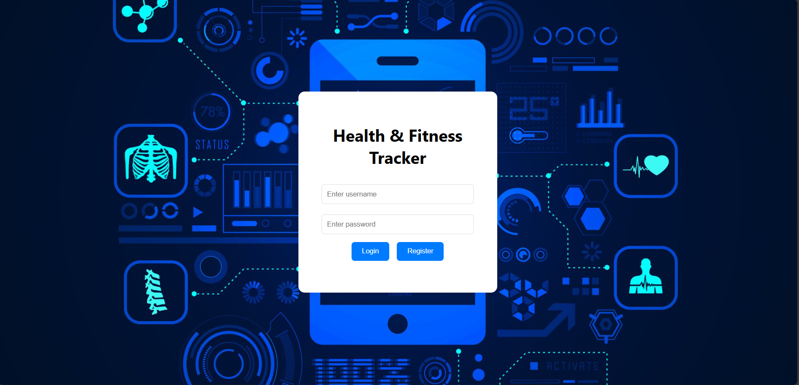
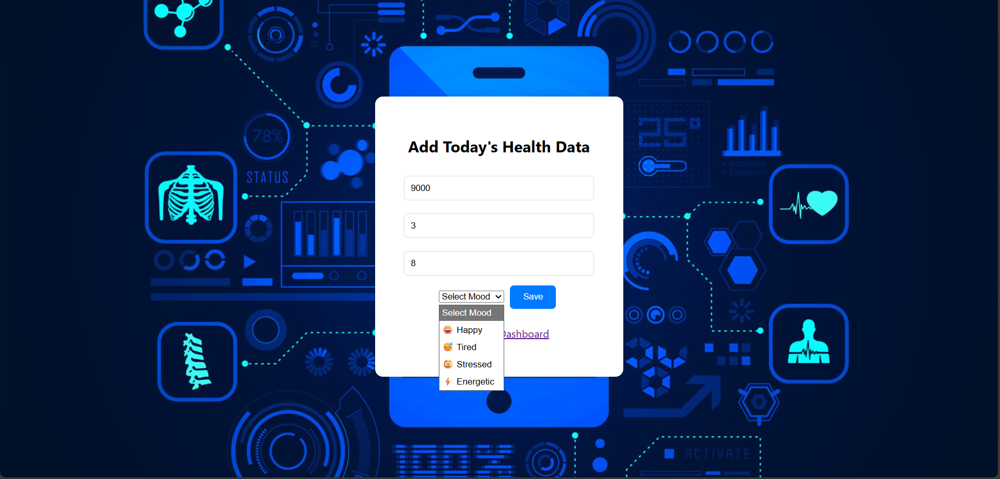
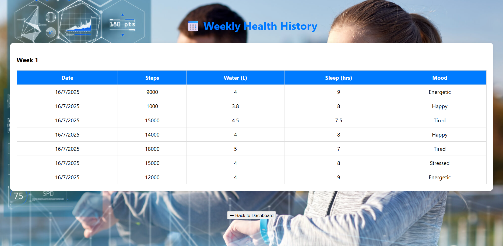
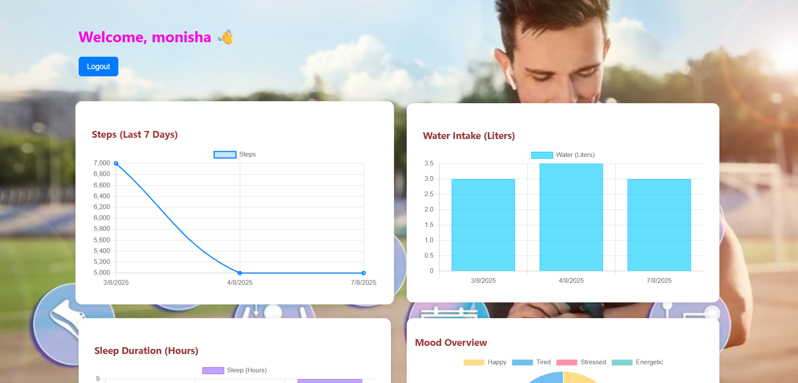

# health-fitness-tracker
A web-based Health &amp; Fitness Tracker for logging daily activities like steps, sleep, water intake, and mood with per-user data privacy and interactive visualizations.
This is a simple yet functional web-based Health & Fitness Tracker that allows users to log and monitor their daily health metrics such as steps walked, water intake, sleep duration, and mood. Built using HTML, CSS, and JavaScript, the app provides a clean UI with interactive charts powered by Chart.js and ensures per-user data privacy using browser localStorage.

# 🏥 Health & Fitness Tracker


A simple and interactive **Health & Fitness Tracker** built using **HTML, CSS, JavaScript, Chart.js, and LocalStorage**. The application helps users record and visualize their daily health activities such as **steps walked, water intake, sleep duration, and mood** through an intuitive dashboard with graphical insights.

---

## 📖 Project Overview

Maintaining healthy habits is easier when progress is tracked consistently. This project provides a lightweight web-based solution that allows users to record their daily fitness activities and monitor their health trends over time.

The application stores all user data locally using **LocalStorage**, eliminating the need for a backend database while providing a smooth user experience.

---

## 🎯 Objective

To help users monitor their daily health habits through an interactive web application.

---

## 👥 Target Users

- 🎓 Students
- 💼 Working Professionals
- 🏃 Fitness Enthusiasts
- ❤️ Anyone interested in maintaining healthy daily habits

---

## ✨ Features

- 🔐 User Registration & Login
- 👋 Personalized Dashboard
- 👣 Daily Step Tracking
- 💧 Water Intake Monitoring
- 😴 Sleep Duration Tracking
- 😊 Mood Selection
- 📊 Interactive Charts using Chart.js
- 📅 Weekly Health History
- 💾 LocalStorage Data Persistence
- 🚪 Secure Logout Functionality
- 📱 Responsive User Interface

---

## 🛠️ Tech Stack

| Technology | Purpose |
|------------|---------|
| HTML5 | Structure |
| CSS3 | Styling & Responsive Design |
| JavaScript (ES6) | Application Logic |
| Chart.js | Data Visualization |
| LocalStorage | Client-side Data Storage |

---

## ⚙️ Installation

1. Clone the repository

```bash
git clone https://github.com/Monisha2109/health-fitness-tracker.git
```

2. Open the project folder.

3. Launch `index.html` in your preferred web browser.

No additional dependencies or server setup are required.

---

## 🚀 How to Use

1. Register a new account.
2. Log in using your credentials.
3. Add your daily health information.
4. View health statistics on the dashboard.
5. Analyze your progress through interactive charts.
6. Review your weekly health history.

---

## 📊 Dashboard Modules

The dashboard provides visual insights into the user's health activities, including:

- 👣 Steps Overview
- 💧 Water Intake Analysis
- 😴 Sleep Duration Statistics
- 😊 Mood Distribution
- 📈 Weekly Progress Charts

---

## 💾 Data Storage

The application uses **LocalStorage** to store:

- User account information
- Daily health records
- Weekly history
- Login session data

This allows users to access their information even after refreshing the browser.

---

## 📸 Screenshots

### 📊 Dashboard



---

### ➕ Add Today's Health Data



---

### 📅 Weekly Health History



---

### 📈 Analytics Dashboard



---

## 🔄 Project Workflow

```
User Registration
        │
        ▼
User Login
        │
        ▼
Dashboard
        │
        ▼
Add Daily Health Data
        │
        ▼
Store in LocalStorage
        │
        ▼
Generate Charts
        │
        ▼
Weekly Health History
```

---

## 🚀 Future Enhancements

- 🔥 Firebase/MySQL Integration
- 🌙 Dark Mode
- 📱 Progressive Web App (PWA)
- 🧮 BMI Calculator
- 🔔 Daily Health Reminders
- 🍎 Calorie Tracking
- 📄 Export Reports as PDF
- 🤖 AI-based Health Suggestions

---

## 📚 Learning Outcomes

Through this project, I gained practical experience in:

- Building responsive web interfaces
- JavaScript DOM Manipulation
- LocalStorage implementation
- User Authentication (Client-side)
- Data Visualization using Chart.js
- Form Validation
- Project Structure and Code Organization

---

## 👩‍💻 Author

**Monisha H**

---

## ⭐ Support

If you found this project useful, consider giving it a ⭐ on GitHub.

It helps support the project and motivates future improvements.
